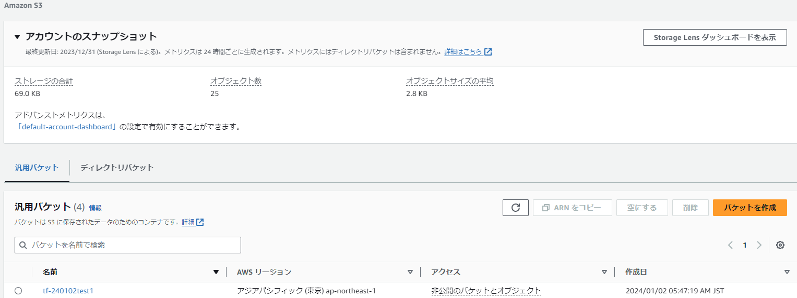

# Terraformのローカルへのインストール方法のメモ
## 背景
* ローカルからAWSリソースを構築したいと思い、その環境づくりです

## 前提
* 操作するCLI：GitBash
* インストール方法：[tfenv](https://github.com/tfutils/tfenv)(GitHub)をDLしてからのインストール
* AWS CLIインストール済み：最後のTerraformの動作確認に使う
 
## 参考記事
* [【AWS】Windows環境でTerraformをインストールしEC2を起動するまでの手順を検証してみた](https://harusite.net/20211128/)
  >[公式の方法](https://developer.hashicorp.com/terraform/tutorials/aws-get-started/install-cli)でインストールしようと最初思いましたが、調べていると上記の記事が秀逸でしたし、terraformのバージョン管理ができるtfenvを使っている点がいいと思い、tfenvでのインストール方法にしました

## インストール実施
* ユーザー名のディレクトリで`git clone`します
```bash
cd ~
pwd
git clone https://github.com/tfutils/tfenv.git .tfenv
```
* .bashrcファイルがない場合）.bashrcを作る
  * 参考記事）https://oki2a24.com/2018/01/15/create-bashrc-then-print-warning-and-auto-generate-bash_profile/
```bash
ls -al | grep .bash
>.bash_history
touch .bashrc
ls -al | grep .bash
>.bash_profile
>.bashrc
```
ターミナル（Gitbash）を再起動すると同階層に`.bash_profile`ファイルが自動生成されています。

* .bashrcを開き以下の記述を追加し、GitBash起動時にPATHが通るように設定します
  * Windowsのエクスプローラーからパスをコピーすると「\」バックスラッシュとしてコピーされ、Cドライブは「C:」となります。
  * GitBashでは`/c/Users/・・・`という表記なので注意が必要
```bash:.bashrc
export PATH=$PATH:/c/Users/username/.tfenv/bin
```
ターミナル（Gitbash）を再起動
```bash
echo $PATH
>.bashrcに書き込んだパスが含まれた表示であれば読み込まれているのでok
tfenv
>以下の通りtfenvのコマンドリファレンスが出てきたらok
tfenv 3.0.0-49-g39d8c27
Usage: tfenv <command> [<options>]

Commands:
   install       Install a specific version of Terraform
   use           Switch a version to use
   uninstall     Uninstall a specific version of Terraform
   list          List all installed versions
   list-remote   List all installable versions
   version-name  Print current version
   init          Update environment to use tfenv correctly.
   pin           Write the current active version to ./.terraform-version
```
* Terraformのインストール
```bash
tfenv list-remote   #現在インストール可能なバージョンが分かる
tfenv install 1.6.6 #最新かつalpha以外をインストールする
tfenv use 1.6.6     #使うverを指定
terraform version   #Terraformのインストール確認
>Terraform v1.6.6
>on windows_amd64
```

## Terraformの動作確認
S3バケットを作ってコンソールで確認してみる
>（注意）`s3://`の後ろはバケットの名前なので好きに入力ください。ただ、よくある名前だと重複問題？ではじかれるので、独自性の高い名前で。
* S3バケット作成
```bash
aws s3 mb s3://tf-240102test1
```
* コンソール画面で確認


* S3バケット削除(確認したら不要なので)
```bash
aws s3 rb s3://tf-240102test1 --force
>remove_bucket: tf-240102test1
```

以上でTerraformのインストール完了です。

### 感想
* 今回に限らずですが、環境変数へのPATHを追加する操作を繰り返しているなかで、”PATHを通す”ことがだんだん理解できてきました。
* 以前CloudFormationで作ったテンプレートファイルを今度はTerraformで作り、環境構築までやってみようと思います。

